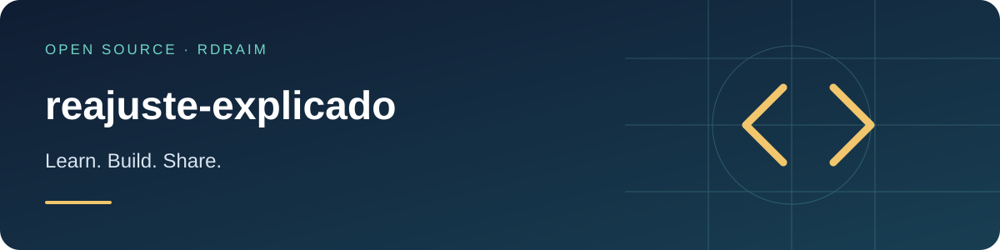

<p align="right">
  <a href="README.md"></a>
  <a href="README.en-US.md"></a>
  <a href="README.es-AR.md"></a>
</p>

# reajuste-explicado



<!-- public-badges:start -->
[](LICENSE) [](https://github.com/Rdraim/reajuste-explicado/actions) [](https://github.com/Rdraim/reajuste-explicado/releases) [](https://github.com/Rdraim/reajuste-explicado/commits/main)
<!-- public-badges:end -->

<p>
  <a href="https://github.com/Rdraim/reajuste-explicado/tree/main/examples"></a>
  <a href="https://github.dev/Rdraim/reajuste-explicado"></a>
  <a href="https://github.com/Rdraim/reajuste-explicado/archive/refs/heads/main.zip"></a>
</p>


A price-adjustment index that **explains changes in the total** — telling **price** apart from **volume**. Pure logic, zero dependencies, Node and browser.

## The problem

It is common for a screen to show the "adjustment" as the **average of the per-item changes**. That is wrong in two ways:

1. **It doesn't reconcile with the total.** If the bill went from `1,000.00` to `1,100.00`, it changed by **10%** — not the 20% applied to a few items. The right index is the one that, applied to the previous total, lands on the new total.
2. **It hides volume.** When the difference comes from an item that **entered** or **left** (not from price), no item "changes value" and the average says "0%", hiding the real change.

This package returns both sides: the total change **and** the price-only change, plus what entered and left.

## Install

```bash
git clone https://github.com/Rdraim/reajuste-explicado.git
cd reajuste-explicado
npm test
```

Or copy `src/index.js` — a dependency-free ESM module.

## Usage

```js
import { analisarPeriodos, calcularReajuste } from './src/index.js';

// From the items of two periods ([{ id, valor }]):
const before = [{ id: 'a', valor: 60 }];
const after  = [{ id: 'a', valor: 60 }, { id: 'b', valor: 40 }];

analisarPeriodos(before, after);
// { pct: 66.67, pct_mesma_base: 0, entraram_valor: 40, sairam_valor: 0, ... }

// Or straight from totals you already summed:
calcularReajuste({ totalAnt: 1000, totalNovo: 1100, pcts: [20] });
// { pct: 10, delta: 100, por_item: { mais_comum: 20, ... }, ... }
```

## API

| function | description |
|---|---|
| `analisarPeriodos(previous, current)` | takes `[{ id, valor }]` for both periods and derives everything |
| `calcularReajuste({ totalAnt, totalNovo, pcts, baseAnt, baseNovo, valorEntraram, valorSairam })` | index from pre-summed totals |
| `variacao(from, to)` | percentage change (2 decimals); `null` with no base |
| `estatisticas(pcts)` | `{ mais_comum, mais_comum_qtd, mediana, media }` of per-item changes |
| `round2(n)` | 2-decimal financial rounding |

Output fields: `pct` (total change), `pct_mesma_base` (price only), `entraram_valor` / `sairam_valor` (volume), `delta`, `por_item` (stats; the **mode** describes the most frequent percentage).

## Limitations

- Works with **already-normalized numbers** (no currency parsing or FX).
- `round2` rounds to two decimals; reconcile with delta and totals, not the rounded percentage.
- Item identity is its `id`: items are the "same base" only when the `id` matches in both periods.

## Tests

```bash
node --test
```

## License

MIT © Rodrigo Rodrigues

Values must be finite; missing/duplicate ids are rejected. Even medians average the central pair. Percentages are rounded: pct may not reproduce the exact total; use delta for reconciliation. JS numbers have limited precision; this is not a decimal accounting ledger. Mode does not establish a contractual index.

## ☕ Buy me a coffee

Did this project help you solve a problem, learn something new, or take your first steps in development? If you feel like supporting my work, a coffee is a kind way to say thank you.

I’m **Rodrigo Rodrigues**, creator of **Nexus** and these open source projects. Your support helps me set aside time to improve the code, write clearer examples, and keep sharing what I learn.

**Give any amount that feels right to you. Supporting is completely optional — the project remains free under the MIT license.**

<p>
  <a href="#support-via-pix"></a>
  <a href="https://github.com/Rdraim/reajuste-explicado/issues/new?title=Feedback%3A%20this%20project%20helped%20me"></a>
</p>

### Support via Pix

In your banking app, scan the QR code or copy the Pix key below. Choose your amount and check the recipient details before confirming.

<p align="center">
  
</p>

**Pix key**

```text
8875a24e-44d1-4c91-b6bb-62c9f0070955
```

Pix is Brazil’s payment system. If your bank does not support it, you can still help by sharing the project, reporting a bug, improving the documentation, or leaving feedback.

### Your feedback matters, too

[Tell me how the project helped you](https://github.com/Rdraim/reajuste-explicado/issues/new?title=Feedback%3A%20this%20project%20helped%20me). I’d love to hear what you built, what you learned, and what could be clearer for someone just starting out.

A comment is welcome with or without a donation. Please keep payment receipts, personal details, credentials and private user data out of public Issues.

---

**Thank you for supporting my work and helping me keep building and sharing. ❤️**
