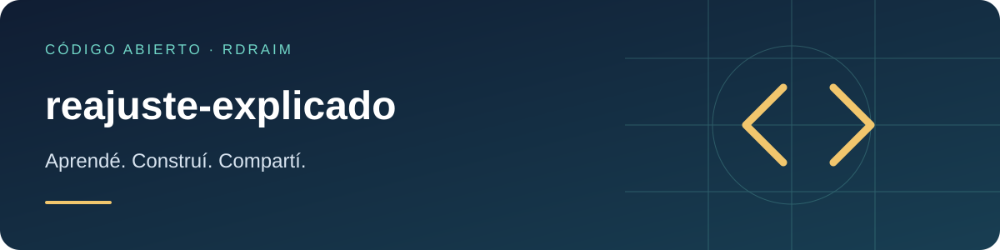

<p align="right">
  <a href="README.md"></a>
  <a href="README.en-US.md"></a>
  <a href="README.es-AR.md"></a>
</p>

# reajuste-explicado



[](LICENSE) [](https://github.com/Rdraim/reajuste-explicado/actions) [](https://github.com/Rdraim/reajuste-explicado/releases) [](https://github.com/Rdraim/reajuste-explicado/commits/main) [](https://github.com/Rdraim/reajuste-explicado/stargazers) [](https://github.com/Rdraim/reajuste-explicado/forks)

<p>
  <a href="https://github.com/Rdraim/reajuste-explicado/tree/main/examples"></a>
  <a href="https://github.dev/Rdraim/reajuste-explicado"></a>
  <a href="https://github.com/Rdraim/reajuste-explicado/archive/refs/heads/main.zip"></a>
</p>


Un índice de ajuste de precios que **cierra con el total** — distinguiendo **precio** de **volumen**. Lógica pura, sin dependencias, Node y navegador.

## El problema

Es común que una pantalla muestre el "ajuste" como el **promedio de las variaciones ítem por ítem**. Eso falla de dos maneras:

1. **No cierra con el total.** Si la cuenta pasó de `1.000,00` a `1.100,00`, varió **10%** — no el 20% aplicado a unos pocos ítems. El índice correcto es el que, aplicado al total anterior, llega al total nuevo.
2. **Oculta el volumen.** Cuando la diferencia viene de un ítem que **entró** o **salió** (y no del precio), ningún ítem "cambia de valor" y el promedio dice "0%", ocultando el cambio real.

Este paquete devuelve ambos lados: la variación del total **y** la variación solo de precio, más lo que entró y salió.

## Instalación

```bash
git clone https://github.com/Rdraim/reajuste-explicado.git
cd reajuste-explicado
npm test
```

O copiá `src/index.js` — un módulo ESM sin dependencias.

## Uso

```js
import { analisarPeriodos, calcularReajuste } from './src/index.js';

// A partir de los ítems de dos períodos ([{ id, valor }]):
const antes   = [{ id: 'a', valor: 60 }];
const despues = [{ id: 'a', valor: 60 }, { id: 'b', valor: 40 }];

analisarPeriodos(antes, despues);
// { pct: 66.67, pct_mesma_base: 0, entraram_valor: 40, sairam_valor: 0, ... }

// O directo desde los totales que ya sumaste:
calcularReajuste({ totalAnt: 1000, totalNovo: 1100, pcts: [20] });
// { pct: 10, delta: 100, por_item: { mais_comum: 20, ... }, ... }
```

## API

| función | descripción |
|---|---|
| `analisarPeriodos(anterior, actual)` | toma `[{ id, valor }]` de ambos períodos y deriva todo |
| `calcularReajuste({ totalAnt, totalNovo, pcts, baseAnt, baseNovo, valorEntraram, valorSairam })` | índice desde totales ya sumados |
| `variacao(de, a)` | variación porcentual (2 decimales); `null` sin base |
| `estatisticas(pcts)` | `{ mais_comum, mais_comum_qtd, mediana, media }` de las variaciones |
| `round2(n)` | redondeo financiero a 2 decimales |

Campos de salida: `pct` (variación del total), `pct_mesma_base` (solo precio), `entraram_valor` / `sairam_valor` (volumen), `delta`, `por_item` (estadísticas; la **moda** es el índice contractual que se repite).

## Limitaciones

- Trabaja con **números ya normalizados** (no parsea moneda ni cambio).
- `round2` usa dos decimales por convención contractual.
- La identidad del ítem es su `id`: son "la misma base" solo cuando el `id` coincide en ambos períodos.

## Tests

```bash
node --test
```

## Licencia

MIT © Rodrigo Rodrigues

Los valores deben ser finitos; ids ausentes/duplicados se rechazan. La mediana par promedia el par central. Porcentajes redondeados: pct puede no reproducir el total exacto; usá delta para conciliar. Los números JS tienen precisión limitada; no reemplaza un libro contable decimal. La moda no demuestra un índice contractual.

## ☕ Invitame un café

¿Este proyecto te ayudó a resolver un problema, aprender algo nuevo o dar tus primeros pasos en desarrollo? Si querés apoyar mi trabajo, un café es una linda forma de agradecer.

Soy **Rodrigo Rodrigues**, creador de **Nexus** y de estos proyectos de código abierto. Tu aporte me ayuda a dedicar tiempo a mejorar el código, escribir ejemplos más claros y seguir compartiendo lo que aprendo.

**Aportá el monto que tenga sentido para vos. El apoyo es totalmente voluntario; el proyecto sigue siendo gratuito bajo la licencia MIT.**

[Apoyá con Pix](#apoyá-con-pix) · [Dejá un comentario](https://github.com/Rdraim/reajuste-explicado/issues/new?title=Comentario%3A%20este%20proyecto%20me%20ayud%C3%B3)

### Apoyá con Pix

En la app de tu banco, escaneá el QR o copiá la clave Pix de abajo. Elegí el monto y revisá los datos del destinatario antes de confirmar.

<p align="center">
  
</p>

**Clave Pix**

```text
8875a24e-44d1-4c91-b6bb-62c9f0070955
```

Pix es el sistema de pagos de Brasil. Si tu banco no lo admite, también podés ayudar compartiendo el proyecto, reportando un problema, mejorando la documentación o dejando un comentario.

### Tu comentario también suma

[Contame cómo te ayudó el proyecto](https://github.com/Rdraim/reajuste-explicado/issues/new?title=Comentario%3A%20este%20proyecto%20me%20ayud%C3%B3). Me gustaría saber qué creaste, qué aprendiste y qué podría ser más claro para quienes recién empiezan.

Los comentarios son bienvenidos con o sin donación. Cuidá tu privacidad: no publiques comprobantes de pago, datos personales, credenciales ni información privada de usuarios en las Issues.

**Gracias por apoyar mi trabajo y ayudarme a seguir creando y compartiendo. ❤️**
