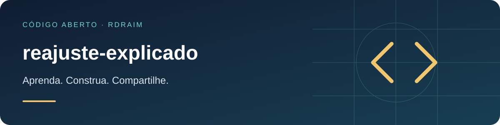

<p align="right">
  <a href="README.md"></a>
  <a href="README.en-US.md"></a>
  <a href="README.es-AR.md"></a>
</p>

# reajuste-explicado



[](LICENSE) [](https://github.com/Rdraim/reajuste-explicado/actions) [](https://github.com/Rdraim/reajuste-explicado/releases) [](https://github.com/Rdraim/reajuste-explicado/commits/main) [](https://github.com/Rdraim/reajuste-explicado/stargazers) [](https://github.com/Rdraim/reajuste-explicado/forks)

<p>
  <a href="https://github.com/Rdraim/reajuste-explicado/tree/main/examples"></a>
  <a href="https://github.dev/Rdraim/reajuste-explicado"></a>
  <a href="https://github.com/Rdraim/reajuste-explicado/archive/refs/heads/main.zip"></a>
</p>


Índice de reajuste que **explica a variação do total** — separando o que é **preço** do que é **volume**. Lógica pura, sem dependências, Node e navegador.

## O problema

É comum uma tela mostrar como "reajuste" a **média das variações item a item**. Isso erra de dois jeitos:

1. **Não fecha com o total.** Se a conta foi de `1.000,00` para `1.100,00`, ela variou **10%** — não os 20% aplicados em alguns itens. O índice certo é aquele que, aplicado ao total anterior, chega no total novo.
2. **Some com o efeito de volume.** Quando a diferença vem de um item que **entrou** ou **saiu** (e não de preço), nenhum item "muda de valor" e a média diz "0%", escondendo a variação real da conta.

Este pacote devolve os dois lados, sem esconder nada: a variação do total **e** a variação só de preço, mais o que entrou e saiu.

## Instalação

```bash
git clone https://github.com/Rdraim/reajuste-explicado.git
cd reajuste-explicado
npm test
```

Ou copie `src/index.js` — é um módulo ESM sem dependências.

## Uso

```js
import { analisarPeriodos, calcularReajuste } from './src/index.js';

// A partir dos itens de dois períodos ([{ id, valor }]):
const antes  = [{ id: 'a', valor: 60 }];
const depois = [{ id: 'a', valor: 60 }, { id: 'b', valor: 40 }];

analisarPeriodos(antes, depois);
// {
//   pct: 66.67,            // o total subiu 66,67%
//   pct_mesma_base: 0,     // mas o preço do item 'a' não mudou
//   entraram_valor: 40,// a diferença veio de volume (item 'b' entrou)
//   sairam_valor: 0,
//   ...
// }

// Ou direto dos totais, quando você já os somou:
calcularReajuste({ totalAnt: 1000, totalNovo: 1100, pcts: [20] });
// { pct: 10, delta: 100, por_item: { mais_comum: 20, ... }, ... }
```

## API

| função | descrição |
|---|---|
| `analisarPeriodos(anterior, novo)` | recebe `[{ id, valor }]` dos dois períodos e deriva tudo |
| `calcularReajuste({ totalAnt, totalNovo, pcts, baseAnt, baseNovo, valorEntraram, valorSairam })` | índice a partir de totais já somados |
| `variacao(de, para)` | variação percentual (2 casas); `null` se não há base |
| `estatisticas(pcts)` | `{ mais_comum, mais_comum_qtd, mediana, media }` das variações item a item |
| `round2(n)` | arredondamento financeiro a 2 casas |

Campos da saída: `pct` (variação do total), `pct_mesma_base` (preço puro), `entraram_valor` / `sairam_valor` (volume), `delta`, `por_item` (estatísticas; a **moda** descreve o percentual mais frequente).

## Limitações

- Trabalha com **números já normalizados** (não faz parsing de moeda nem câmbio).
- `round2` arredonda a duas casas; use delta e totais para conciliar, não o percentual arredondado.
- Identidade do item é a sua `id`: itens só são "a mesma base" quando têm a mesma `id` nos dois períodos.

## Testes

```bash
node --test
```

## Licença

MIT © Rodrigo Rodrigues

Valores devem ser finitos; ids ausentes/duplicados são rejeitados. Mediana par usa a média central. Percentuais são arredondados: pct não reproduz necessariamente o total exato; use delta para reconciliar. Números JS têm precisão limitada; não substitui um livro contábil decimal. A moda não comprova índice contratual.

## ☕ Me pague um café

Este projeto te ajudou a resolver um problema, aprender algo novo ou dar os primeiros passos no desenvolvimento? Se você sentir vontade de apoiar meu trabalho, um café é uma forma carinhosa de agradecer.

Sou **Rodrigo Rodrigues**, criador do **Nexus** e destes projetos de código aberto. Seu apoio me ajuda a dedicar tempo para melhorar o código, escrever exemplos mais claros e continuar compartilhando o que aprendo.

**Contribua com o valor que fizer sentido para você. O apoio é totalmente voluntário — o projeto continua gratuito sob a licença MIT.**

<p>
  <a href="#apoie-com-pix"></a>
  <a href="https://github.com/Rdraim/reajuste-explicado/issues/new?title=Coment%C3%A1rio%3A%20este%20projeto%20me%20ajudou"></a>
</p>

### Apoie com Pix

No aplicativo do seu banco, escaneie o QR Code ou copie a chave Pix abaixo. Escolha o valor e confira os dados do destinatário antes de confirmar.

<p align="center">
  
</p>

**Chave Pix**

```text
8875a24e-44d1-4c91-b6bb-62c9f0070955
```

Você também pode apoiar compartilhando o projeto, relatando um problema, melhorando a documentação ou deixando um comentário.

### Seu comentário também faz diferença

[Conte como o projeto te ajudou](https://github.com/Rdraim/reajuste-explicado/issues/new?title=Coment%C3%A1rio%3A%20este%20projeto%20me%20ajudou). Vou gostar de saber o que você criou, o que aprendeu e o que poderia ficar mais claro para quem está começando.

O comentário é bem-vindo com ou sem doação. Preserve sua privacidade: não publique comprovantes, dados pessoais, credenciais ou informações de usuários nas Issues.

---

**Obrigado por apoiar meu trabalho e me ajudar a continuar criando e compartilhando. ❤️**
